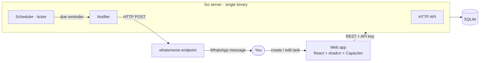

# ADR 0001 — Architecture & Tech Stack

- **Status:** Accepted
- **Date:** 2026-06-14
- **Deciders:** @Rudhery

## Context

Nudge is a **self-hosted, single-user** personal organizer (tasks first, then
notes and finance) that **reminds you over WhatsApp** at the right time. The
guiding principle is explicit:

> A tool that *looks* complex can actually be simple.

So the architecture optimizes for **few moving parts**, **easy self-hosting**,
and **no unnecessary infrastructure** — no message broker, no microservices, no
external database server, no AI.

Two facts shape everything:

1. The reminder must arrive **even when the app is closed**. A push from a phone
   app is unreliable in the background, so delivery must be **server-driven**.
2. The user already runs a **whatsmeow** (Go) service with an **open HTTP
   endpoint to send WhatsApp messages**. Delivery is therefore a *solved
   problem* — the backend only needs to **schedule** and **call** it.

## Decision

A **monorepo** with two deployables and one database file:



### Stack

| Layer       | Choice                                             | Why |
| ----------- | -------------------------------------------------- | --- |
| Frontend    | React + Vite + TypeScript + Tailwind + shadcn/ui   | Great UI, builds to static files, packages to Android via Capacitor and runs as a PWA |
| Backend     | **Go** — single binary (API + scheduler + Notifier)| One process to deploy; first-class concurrency for the scheduler; trivial to run next to the existing whatsmeow service |
| Database    | **SQLite**                                         | Zero-ops, single file, ideal for one user; no server to run |
| Delivery    | HTTP call to the self-hosted **whatsmeow** endpoint| Reuses what already works; no WhatsApp Business API, no fees |

### Repository layout

```
nudge/
├─ web/                      # React frontend (scaffolded)
├─ server/                   # Go backend
│  ├─ cmd/nudge/             # main.go — entrypoint
│  ├─ internal/
│  │  ├─ config/             # env loading
│  │  ├─ task/               # domain: model + SQLite store + service
│  │  ├─ api/                # router, handlers, auth middleware
│  │  ├─ scheduler/          # ticker: find due reminders → dispatch
│  │  └─ notify/             # Notifier interface + whatsmeow adapter
│  ├─ migrations/            # SQL schema
│  └─ go.mod
├─ docs/adr/                 # architecture decision records
└─ .github/                  # workflows, templates, labels
```

### Data model (Tasks — MVP)

| Field          | Type        | Notes |
| -------------- | ----------- | ----- |
| `id`           | TEXT (UUID) | Primary key |
| `title`        | TEXT        | Required |
| `notes`        | TEXT        | Optional |
| `priority`     | TEXT        | `low` \| `medium` \| `high` |
| `due_at`       | TIMESTAMP   | Optional |
| `remind_at`    | TIMESTAMP   | When to send the nudge (optional) |
| `reminded_at`  | TIMESTAMP   | Set once the nudge is sent (idempotency guard) |
| `completed_at` | TIMESTAMP   | Null = not done |
| `created_at`   | TIMESTAMP   | |
| `updated_at`   | TIMESTAMP   | |

### HTTP API

- JSON over HTTP, authenticated with a single key: `Authorization: Bearer <API_KEY>`.
- `GET /healthz`
- `GET /api/tasks` · `POST /api/tasks` · `GET /api/tasks/{id}` ·
  `PATCH /api/tasks/{id}` · `DELETE /api/tasks/{id}` ·
  `POST /api/tasks/{id}/complete`

### Scheduler

A simple `time.Ticker` (every ~30s) — **no cron dependency**:

1. Query tasks where `remind_at <= now() AND reminded_at IS NULL AND completed_at IS NULL`.
2. For each, call the `Notifier`; on success, set `reminded_at = now()`.
3. The `reminded_at` guard makes it **idempotent** and safe across restarts.

Timezone comes from config (`TIMEZONE`, IANA). Reminders older than a
configurable grace window are skipped to avoid a burst after long downtime.

### Notifier (delivery abstraction)

```go
type Notifier interface {
    Send(ctx context.Context, recipient, message string) error
}
```

The MVP implementation is an **HTTP adapter** that POSTs to the whatsmeow
endpoint. It is **fully configurable** so it adapts to the real endpoint with
**zero code changes** — and so Telegram / push can be added later as additional
`Notifier`s.

> ⚠️ **Assumption to confirm.** Until the exact whatsmeow contract is provided,
> the adapter assumes:
>
> ```http
> POST {WHATSAPP_API_URL}
> Authorization: Bearer {WHATSAPP_API_TOKEN}   # only if set
> Content-Type: application/json
>
> { "to": "{REMINDER_RECIPIENT}", "message": "{text}" }
> ```
>
> If your endpoint differs (path, field names, auth style), we adjust **config /
> a small body template** — not the architecture.

### Configuration (env)

Documented in [`.env.example`](../../.env.example): `API_PORT`, `API_KEY`,
`DATABASE_PATH`, `WHATSAPP_API_URL`, `WHATSAPP_API_TOKEN`, `REMINDER_RECIPIENT`,
`TIMEZONE`. **No secret is ever committed** (see [SECURITY.md](../../SECURITY.md)).

### Dev vs. prod wiring

- **Dev:** Vite dev server proxies `/api` to the Go server (two processes).
- **Prod:** the Go binary **serves the built `web/dist`** as static files, so the
  whole app is **one origin, one process** — no CORS, one thing to deploy next to
  whatsmeow.

## Consequences

**Positive**

- One binary + one SQLite file + one static frontend → genuinely simple to run.
- Reminders are reliable (server-driven) and cost nothing (own WhatsApp number).
- The `Notifier` interface makes Telegram/push drop-in later.
- Modules (notes, finance) are added without touching tasks.

**Trade-offs**

- SQLite + single binary is single-user / single-node by design (acceptable — it
  is a personal app).
- The scheduler polls (every ~30s) instead of using precise timers — simpler, and
  more than precise enough for human reminders.
- Coupling to the whatsmeow endpoint contract is mitigated by keeping it in config.

## Alternatives considered

- **Node/Express backend** — fine, but Go gives a single static binary and
  cleaner long-running concurrency for the scheduler; it also sits naturally
  beside the existing Go/whatsmeow service.
- **Postgres** — overkill for one user; adds a server to operate.
- **Phone-local notifications only** — rejected: unreliable when the app is
  closed, which defeats the core purpose.
- **A cron library / external scheduler** — unnecessary; a `time.Ticker` is
  enough and removes a dependency.

## Roadmap touchpoints

- **v0.1.0** — Tasks MVP (this architecture).
- **v0.1.x** — recurring tasks, snooze.
- **Phase 2** — reply "done" / "snooze" over WhatsApp (whatsmeow already receives).
- **Phase 3** — Telegram + push Notifiers; natural-language due dates.
